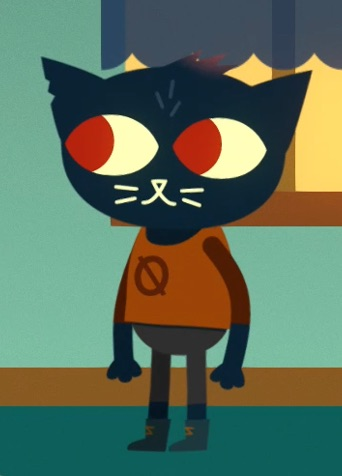
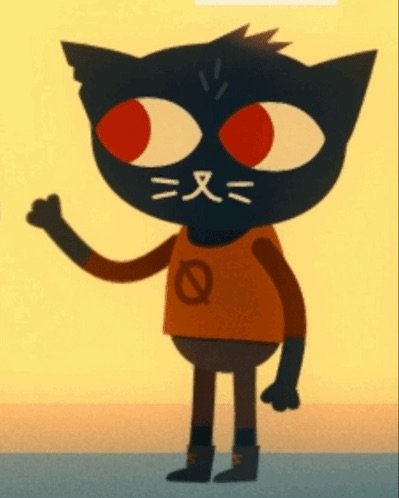
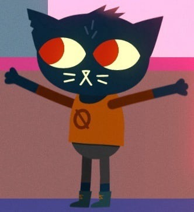
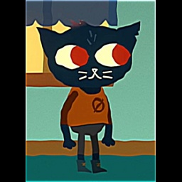
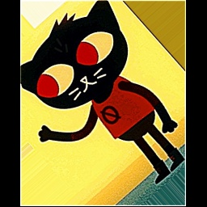
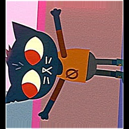

# University-Machine-learning

## Отчёт по лабораторной работе  
**Тема:** Классические методы машинного обучения (kNN, SVM, RandomForest) без нейронных сетей.

---

## 1. Постановка задачи
- **Задача:** трёхклассовая классификация изображений (классы `down`, `one`, `up`).  
- **Датасет:** набор фотографий трёх поз/жестов; исходные (без аугментаций) примеры:
  - Класс `down`: руки опущены вниз (файл `dataset/raw/down_1.jpeg`):
     - 
  - Класс `one`: поднята только одна рука (файл `dataset/raw/one_7.jpeg`):
     - 
  - Класс `up`: обе руки подняты вверх (файл `dataset/raw/up_2.jpeg`):
     - 
- **Методы, изученные в работе:** аугментация данных, kNN, SVM, Random Forest (RF).

---

## 2. Подготовка датасета (частично относится к заданию 3 — аугментация)
- **Аугментации** (набор трансформаций для 2D-изображений): использована библиотека [**MONAI**](https://monai-dev.readthedocs.io/en/latest/index.html). В финальной версии применялись более мягкие/контролируемые аугментации:
  - горизонтальный/вертикальный флип,
  - небольшой поворот (±15°),
  - локальный зум,
  - лёгкий гауссов шум / размытие / резкость,
  - контраст/гистограмма, случайное выбрасывание пикселей.
- **Предобработка:** все изображения приводятся к квадратному виду и единому размеру (256×256) с сохранением соотношения сторон и добавлением паддинга (отступа вокруг изображения) — для того, чтобы признаки (HOG, Hu, HSV) были вычислимы в однотипном пространстве признаков и масштаб признаков не зависел от исходного размера.
- **Команды (pipeline):**
  1. Аугментация:
	 ```
	 python3 scripts/augment.py --input_dir datasets/raw --output_dir dataset/raw --num_aug 9
	 ```
  2. Предобработка (resize + pad -> processed):
     ```
     python3 scripts/preprocess.py --raw_dir datasets/raw --output_dir datasets/processed --img_size 256
     ```
  3. (Ручной шаг) часть файлов из `train` была перемещена в `test`, чтобы получить итоговый небольшой тестовый набор.
- **Примеры файлов ПОСЛЕ предобработки и аугментаций:**
  - Класс `down`: руки опущены вниз (файл `dataset/processed/train/down/down_1_aug7_proc256.jpeg`):
     - 
  - Класс `one`: поднята только одна рука (файл `dataset/processed/train/one/one_7_aug9_proc256.jpeg`):
     - 
  - Класс `up`: обе руки подняты вверх (файл `dataset/processed/train/up/up_2_aug2_proc256.jpeg`):
     - 

---

## 3. Задача 1 — сравнение методов kNN и SVM

### Описание методов
- **kNN (k-Nearest Neighbors):** присваивание метки по большинству среди k ближайших соседей в пространстве признаков (обычно евклидово расстояние).  
  Формула:  
  \[
  \hat y(x)=\operatorname{mode}\{y_i : x_i\in \mathcal N_k(x)\}.
  \]
- **SVM (Support Vector Machine, RBF ядро):** максимизация разделяющей полосы с регуляризацией; с RBF-ядром классификация становится нелинейной:
  \[
  K(x, x')=\exp(-\gamma\|x-x'\|^2).
  \]
  Решающая задача включает параметр `C` — жёсткость штрафа за ошибки.

### Реализация и гиперпараметры (где в коде)
- Библиотека: `scikit-learn`.
- В коде (`train.py`):
  - kNN: `from sklearn.neighbors import KNeighborsClassifier` → `KNeighborsClassifier(n_neighbors=5)`
  - SVM: `from sklearn.svm import SVC` → `SVC(kernel="rbf", C=1.0, gamma="scale")`
- Оценка: 5-fold Stratified cross-validation (`sklearn.model_selection.StratifiedKFold`) — средняя accuracy и std.
- Команды запуска:
  ```bash
  python3 scripts/train.py --data_dir datasets/<dataset>/processed/train --models_dir models/<folder>
  python3 scripts/test.py  --data_dir datasets/<dataset>/processed/test  --models_dir models/<folder> --out_dir reports/<folder>